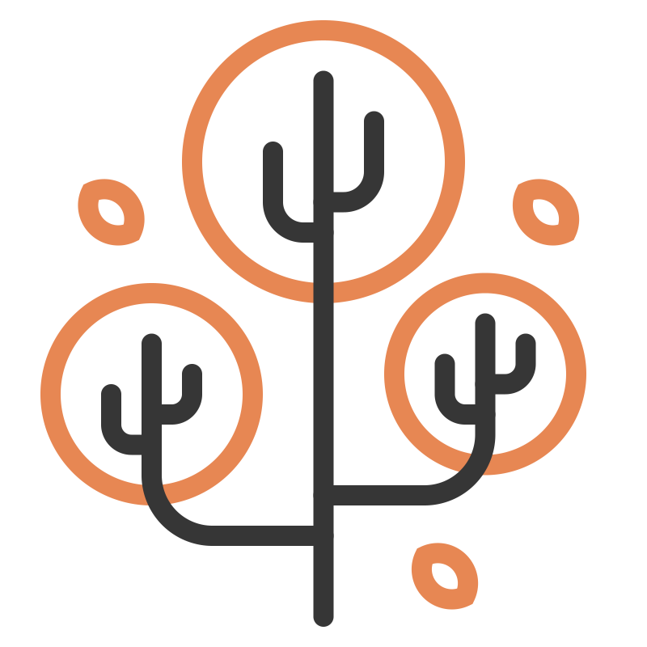

<div align="center">
  <picture>
    
  </picture>
<br>

<h2>Spart</h2>

[](https://github.com/habedi/spart/actions/workflows/tests.yml)
[](https://codecov.io/gh/habedi/spart)
[](https://www.codefactor.io/repository/github/habedi/spart)
[](https://crates.io/crates/spart)
[](https://docs.rs/spart)
[](https://www.rust-lang.org)
[](https://github.com/habedi/spart)

A collection of space partitioning trees for Rust

</div>

---

Spart (**spa**ce **par**titioning **t**rees) is a Rust library that provides implementations of popular
space partitioning tree data structures for efficient indexing and searching of 2D and 3D point data.
Spart also provides Python bindings for the trees.
So, you can use Spart from Python projects as well as from Rust projects.

At the moment, the following data structures and features are supported:

| # | Tree Type                                          | 2D | 3D | kNN Search | Range Search |
|---|----------------------------------------------------|----|----|------------|--------------|
| 1 | [Quadtree](https://en.wikipedia.org/wiki/Quadtree) | ✓  |    | ✓          | ✓            |
| 2 | [Octree](https://en.wikipedia.org/wiki/Octree)     |    | ✓  | ✓          | ✓            |
| 3 | [Kd-tree](https://en.wikipedia.org/wiki/K-d_tree)  | ✓  | ✓  | ✓          | ✓            |
| 4 | [R-tree](https://en.wikipedia.org/wiki/R-tree)     | ✓  | ✓  | ✓          | ✓            |
| 5 | [R*-tree](https://en.wikipedia.org/wiki/R*-tree)   | ✓  | ✓  | ✓          | ✓            |

> [!IMPORTANT]
> Spart is in early development, so bugs and breaking API changes are expected.
> Please use the [issues page](https://github.com/habedi/spart/issues) to report bugs or request features.

---

### Installation

```bash
cargo add spart
````

*Spart requires Rust 1.83.0 or later.*

#### Python Bindings

You can install the Python bindings for Spart using pip:

```shell
pip install pyspart
```

- Quick start examples (including R*-tree) are available under [pyspart/examples](pyspart/examples).
- You can run all Python examples at once from the repo root:
  - make run-py-examples
- Or run the R*-tree example directly:
  - python pyspart/examples/r_star_tree.py

---

### Documentation

For the Rust API documentation, see [docs.rs/spart](https://docs.rs/spart).

#### Basic Concepts

The basic building blocks of Spart are **point** and **tree**.

##### Point

A point is a tuple of coordinates plus an optional data payload of any type.
There are two types of points: `Point2D` and `Point3D`.

Example of 2D and 3D points:

```rust
use spart::geometry::{Point2D, Point3D};

fn main() {
    // 2D point with coordinates (1.0, 2.0) and data "A 2D Point".
    let point_2d = Point2D {
        x: 1.0,
        y: 2.0,
        data: Some("A 2D Point"),
    };

    // 3D point with coordinates (1.0, 2.0, 3.0) and data "A 3D Point".
    let point_3d = Point3D {
        x: 1.0,
        y: 2.0,
        z: 3.0,
        data: Some("A 3D Point"),
    };
}
```

##### Tree

A tree is a spatial data structure that indexes points and provides methods for querying them.

Currently, the following trees are implemented:

- Quadtree (2D)
- Octree (3D)
- Kd-tree (2D and 3D)
- R-tree (2D and 3D)
- R*-tree (2D and 3D)

A tree provides at least the following methods:

- `new`: creates a new tree given the following parameters:
    - The bounding area of the tree (for Quadtree and Octree only)
    - The number of dimensions (for Kd-tree only)
    - The maximum capacity of points per node (for Quadtree, Octree, and R-tree)
- `insert`: inserts a point into the tree.
- `insert_bulk`: inserts multiple points into the tree at once.
    - This is generally more efficient than inserting points one by one.
- `delete`: removes a point from the tree.
- `knn_search`: finds the k nearest neighbors to a query point.
    - The inputs are the query point and the number of neighbors to find.
- `range_search`: finds all points within a given range of a query point.
    - The inputs are the query point and the range within which to search.

> [!NOTE]
> Currently, the following properties hold for all trees:
> - Duplicates are allowed: inserting a duplicate point will add another copy to the tree.
> - Searches return duplicates: both `knn_search` and `range_search` can return duplicate points if they were previously
    inserted.
> - Deletion removes duplicates: the `delete` operation removes **all** instances of the point from the tree.
> - A `knn_search` with `k=0` will return an empty list.
> - A `knn_search` with `k` greater than the number of points in the tree will return all points.
> - A `range_search` with a radius of `0` will return only points with the exact same coordinates.
>
> The distance metric used for nearest neighbor and range searches is the Euclidean distance by default.
> However, you can use a custom distance metric by implementing the `Distance` trait.

### Additional Information

#### Debugging Mode

You can enable debugging mode for Spart by setting the `DEBUG_SPART` environment variable to `true` or `1`.

```bash
# Enable debugging mode on Linux and macOS
export DEBUG_SPART=true
```

```powershell
# Enable debugging mode on Windows (PowerShell)
$env:DEBUG_SPART = "true"
```

> [!NOTE]
> When debugging mode is enabled, Spart will be very verbose.
> It is recommended to use this only for debugging purposes.

#### Serialization

Spart trees can be serialized and deserialized using the `serde` feature.

To enable serialization in Rust, you need to enable the `serde` feature in your `Cargo.toml` file:

```toml
[dependencies]
spart = { version = "0.1.0", features = ["serde"] }
```

Then, you can use `bincode` (or any other serde-compatible library) to serialize and deserialize the tree:

```rust
use spart::geometry::{Point2D, Rectangle};
use spart::quadtree::Quadtree;

fn main() {
    let boundary = Rectangle {
        x: 0.0,
        y: 0.0,
        width: 100.0,
        height: 100.0,
    };
    let mut qt = Quadtree::new(&boundary, 4);
    qt.insert(Point2D::new(10.0, 20.0, Some("point1".to_string())));
    qt.insert(Point2D::new(50.0, 50.0, Some("point2".to_string())));

    // Serialize the tree
    let encoded: Vec<u8> = bincode::serialize(&qt).unwrap();

    // Deserialize the tree
    let decoded: Quadtree<String> = bincode::deserialize(&encoded[..]).unwrap();
}
```

### Examples

- For Rust examples, see the [examples](examples) directory.
- For Python examples, see [pyspart/examples](pyspart/examples).

---

### Contributing

See [CONTRIBUTING.md](CONTRIBUTING.md) for details on how to make a contribution.

### License

Spart is available under the terms of either of the following licenses:

* MIT License ([LICENSE-MIT](LICENSE-MIT))
* Apache License, Version 2.0 ([LICENSE-APACHE](LICENSE-APACHE))

### Acknowledgements

* The logo is from [SVG Repo](https://www.svgrepo.com/svg/382456/autumn-fall-leaf-orange-season-tree).
